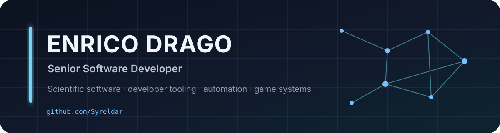

  

  
  
  

  I build maintainable software across scientific tooling, automation, developer workflows, data processing, and game systems.

## About

I'm **Enrico Drago**, a Senior Software Developer based in Messina, Italy.

My work spans systems and application development, scientific software, automation, data processing, and game-related tooling. I care about software that is **maintainable, reproducible, well documented, and usable outside the machine on which it was written**.

I work primarily with **C++, C#, Java, Python, JavaScript, Lua, and SQL**.

## Featured work

### 🔭 [PHOTO-CAT](https://github.com/Syreldar/photo-cat)

**Photometric Contamination Analyzer Tool** — cross-platform scientific software for catalogue-level photometric contamination analysis and target screening.

- GUI and CLI workflows
- Windows, macOS, and Linux support
- reproducible catalogue-processing pipelines
- scientific plotting, reporting, validation, and benchmarking
- provenance and reproducibility tooling
- automated testing, CI/CD, and packaging
- English and Italian interfaces/documentation

  
  

### 🎮 Open-source & game systems

I also work with established game codebases, tooling, ROM-hacking projects, and quality-of-life modifications. My [`pokeemerald-expansion`](https://github.com/Syreldar/pokeemerald-expansion) repository is a personal development fork of the RHH project used for experimentation and custom changes on top of the upstream codebase.

## Toolbox

**Languages**

  
  
  
  
  
  
  

**Tools & platforms**

  
  
  
  

**Areas**

`Scientific Software` · `Automation` · `Developer Tooling` · `Data Processing` · `Software Architecture` · `Game Development` · `CI/CD`

## Engineering interests

- scientific and reproducible software
- developer tooling and automation
- cross-platform application development
- software architecture and maintainability
- data processing and visualization
- game systems, modding, and tooling

## Research

For research-related work and identity:

---

  Profile repository for <a href="https://github.com/Syreldar">@Syreldar</a>.

